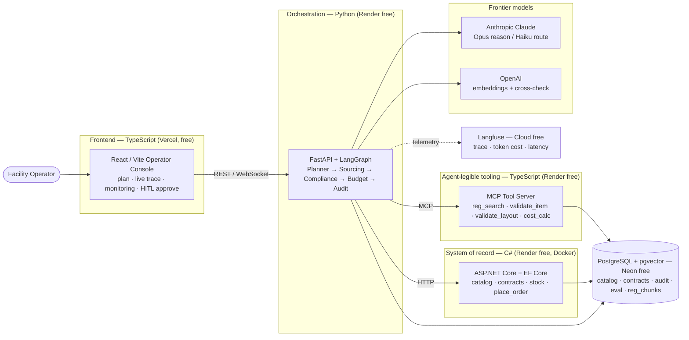
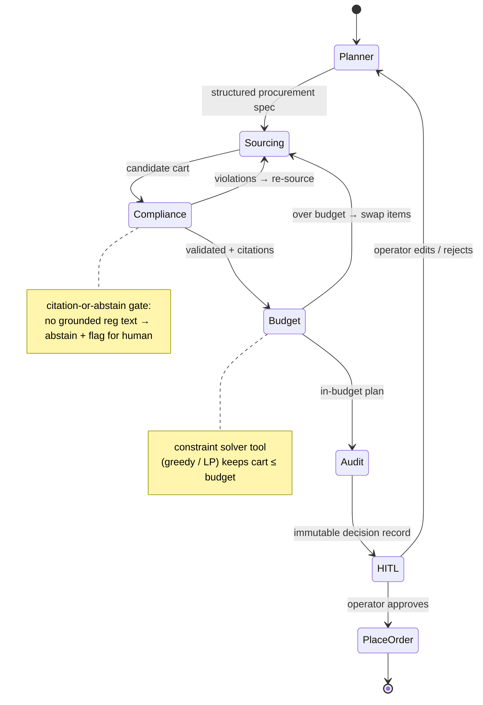
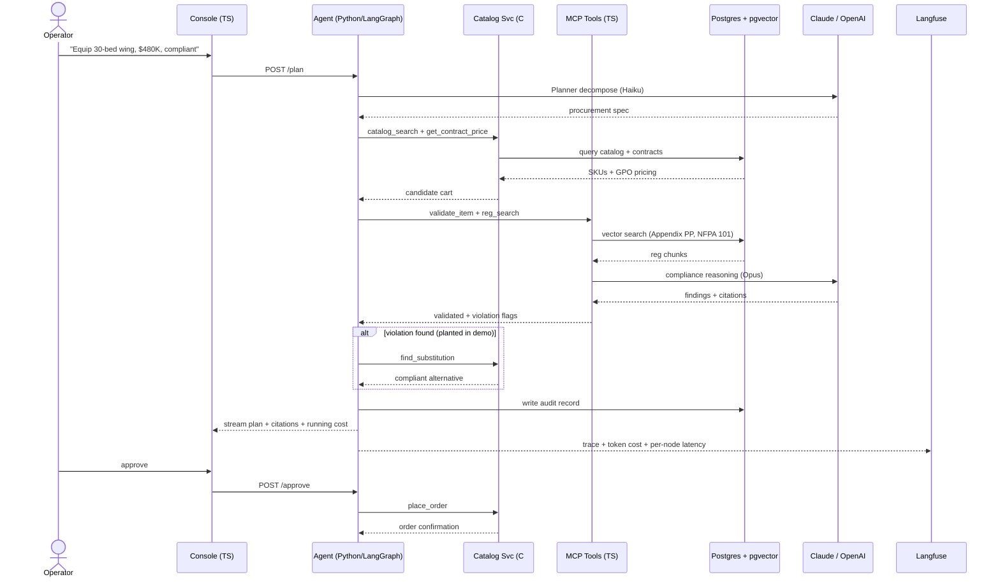
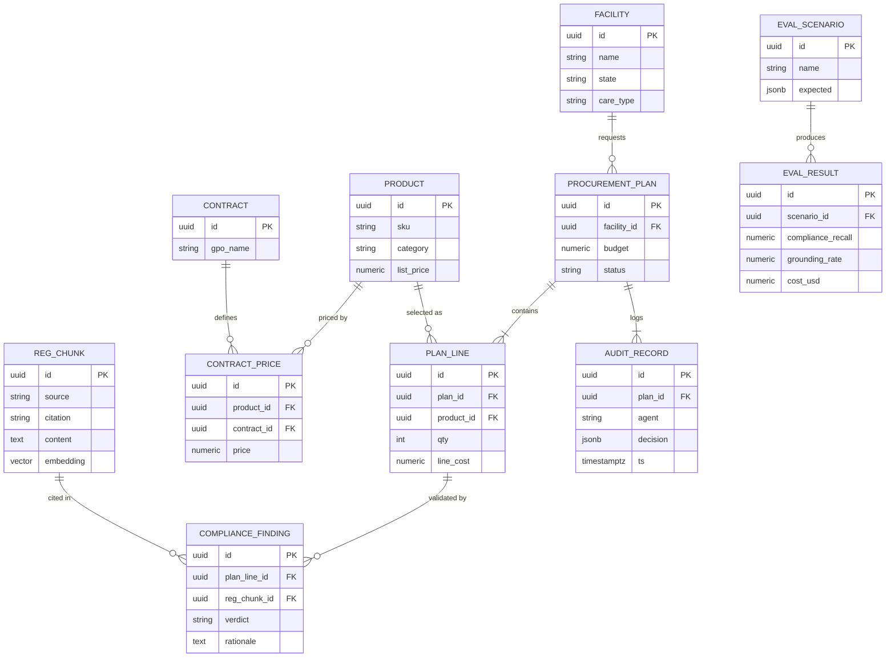
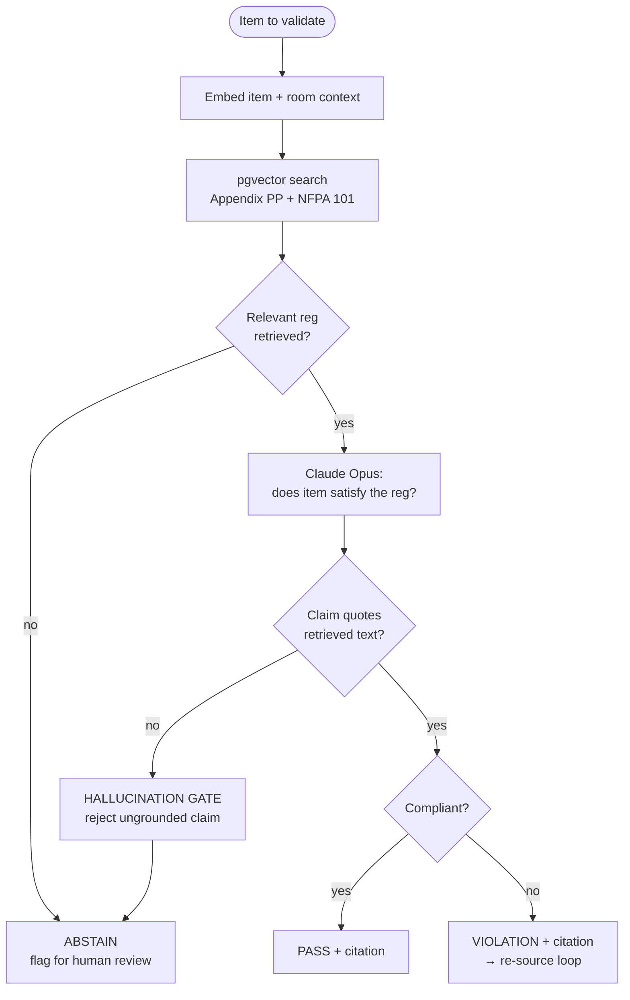
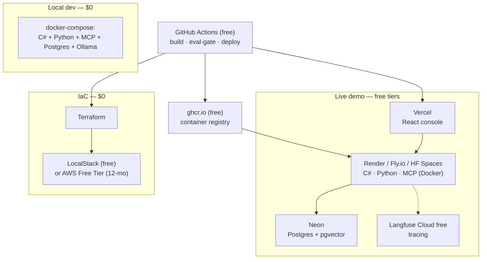
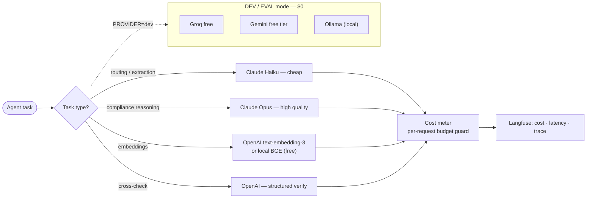
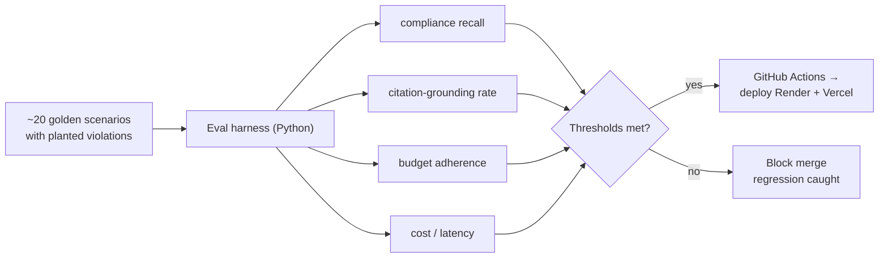

# Sentinel — Architecture Diagrams (Direct Supply demo)
Companion to `direct-supply-demo-plan.md`. Eight in-depth Mermaid diagrams. All render on GitHub.

---

## 1. System container diagram (polyglot stack + free hosts)
Every JD technology, and where it runs for free.



---

## 2. Agent orchestration — LangGraph state machine
Stateful graph with re-source loops and a human-in-the-loop interrupt.



---

## 3. End-to-end request sequence (incl. live violation catch)
The exact flow you narrate in the demo.



---

## 4. Data model (PostgreSQL ERD)
One Postgres instance; C# writes catalog/contracts, Python writes audit/eval, pgvector holds regs.



---

## 5. Compliance: citation-or-abstain (the trust mechanism)
Why the agent can be trusted in a regulated domain.



---

## 6. Free deployment topology ($0 end-to-end)
Local dev and a live demo, both at no cost.



---

## 7. Model routing & cost control (Anthropic + OpenAI + free fallback)
Provider-agnostic, cost-aware — maps directly to the JD's "cost/performance tradeoffs."



---

## 8. Eval-gated CI/CD (the "operate" proof)
Regressions in compliance recall block the deploy.


```
```
